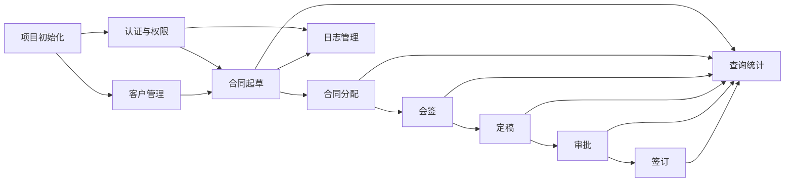

# 合同管理系统任务拆分

## 1. 工作分解结构

### 1.1 项目初始化

| 编号 | 任务 | 说明 | 优先级 |
| --- | --- | --- | --- |
| INIT-01 | 创建后端工程 | Spring Boot 3、Maven、基础包结构 | P0 |
| INIT-02 | 创建前端工程 | Vite、路由、UI 组件库、Axios | P0 |
| INIT-03 | 数据库初始化 | MySQL 数据库、建表脚本、基础字典数据 | P0 |
| INIT-04 | 统一规范 | 响应结构、错误码、分页、命名、Git 分支 | P0 |

### 1.2 认证与权限

| 编号 | 任务 | 说明 | 优先级 |
| --- | --- | --- | --- |
| AUTH-01 | 用户注册 | 新用户注册，默认无业务权限 | P0 |
| AUTH-02 | 用户登录 | 账号密码登录，返回 JWT | P0 |
| AUTH-03 | 当前用户 | 获取当前用户、角色、权限点、菜单 | P0 |
| AUTH-04 | 用户管理 | 管理员增删改查、启停用户 | P0 |
| AUTH-05 | 角色管理 | 角色增删改查 | P0 |
| AUTH-06 | 权限管理 | 功能权限点维护，角色绑定权限 | P0 |
| AUTH-07 | 用户角色 | 用户绑定角色 | P0 |

### 1.3 客户管理

| 编号 | 任务 | 说明 | 优先级 |
| --- | --- | --- | --- |
| CUST-01 | 客户新增 | 名称、电话、地址必填 | P0 |
| CUST-02 | 客户查询 | 按编号、名称、电话模糊查询 | P0 |
| CUST-03 | 客户修改 | 修改基础信息 | P0 |
| CUST-04 | 客户删除 | 无合同引用时允许删除，或软删除 | P1 |

### 1.4 合同主流程

| 编号 | 任务 | 说明 | 优先级 |
| --- | --- | --- | --- |
| CON-01 | 起草合同 | 创建合同，上传附件，状态为 DRAFT | P0 |
| CON-02 | 合同附件 | 附件上传、下载、删除 | P0 |
| CON-03 | 分配合同 | 管理员指定会签、审批、签订人员 | P0 |
| CON-04 | 待办列表 | 根据当前用户展示待会签/待审批/待签订 | P0 |
| CON-05 | 会签合同 | 会签意见不能为空，全员完成后进入会签完成 | P0 |
| CON-06 | 定稿合同 | 起草人根据会签意见修改内容并提交审批 | P0 |
| CON-07 | 审批合同 | 审批通过/拒绝，记录审批意见 | P0 |
| CON-08 | 签订合同 | 录入签订信息，合同流程结束 | P0 |
| CON-09 | 合同详情 | 基础信息、附件、流程记录、当前状态 | P0 |
| CON-10 | 合同删除 | 管理员或起草人按权限删除草稿合同 | P1 |

### 1.5 查询统计与日志

| 编号 | 任务 | 说明 | 优先级 |
| --- | --- | --- | --- |
| QUERY-01 | 合同信息查询 | 编号、名称、客户、状态、日期范围 | P0 |
| QUERY-02 | 合同流程查询 | 根据状态或合同查看流程节点 | P0 |
| QUERY-03 | 首页统计 | 待办数、合同状态分布、近期合同 | P1 |
| LOG-01 | 操作日志记录 | 增删改、权限变更、流程操作 | P0 |
| LOG-02 | 日志查询 | 操作人、模块、时间范围、关键字 | P1 |
| LOG-03 | 日志导出 | CSV 或 Excel | P2 |

### 1.6 测试与部署

| 编号 | 任务 | 说明 | 优先级 |
| --- | --- | --- | --- |
| TEST-01 | 后端单元测试 | 权限、状态流转、校验规则 | P0 |
| TEST-02 | 接口测试 | Postman/Apifox 用例 | P0 |
| TEST-03 | 前端联调 | 登录、菜单、合同流程闭环 | P0 |
| TEST-04 | 部署说明 | 本地启动、数据库脚本、账号初始化 | P0 |

## 2. 模块依赖关系



## 3. 后端包结构建议

```text
com.contractsys
  common
    config
    exception
    response
    security
  auth
  user
  role
  permission
  customer
  contract
    api
    application
    domain
    infrastructure
  file
  log
```

## 4. 前端目录建议

```text
src
  api
  assets
  components
  layouts
  router
  stores
  styles
  utils
  views
    auth
    dashboard
    contract
    customer
    system
    log
```

## 5. 第一轮迭代建议

第一轮目标是打通“登录 -> 起草合同 -> 管理员分配 -> 用户会签 -> 起草人定稿 -> 审批 -> 签订”的最小闭环。

优先做：

1. 用户、角色、权限基础数据。
2. 登录鉴权和菜单权限。
3. 客户管理。
4. 合同起草和附件上传。
5. 合同流程任务表和状态流转。
6. 合同详情页和流程记录。

