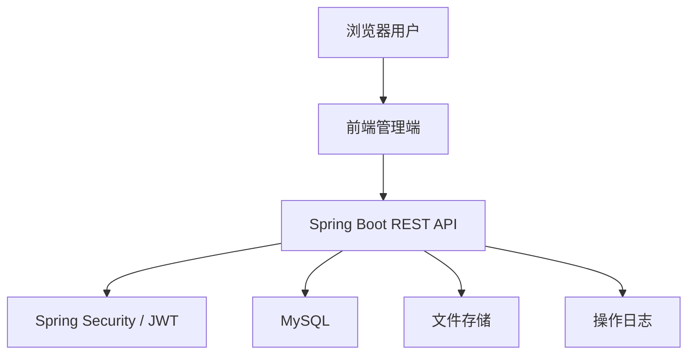
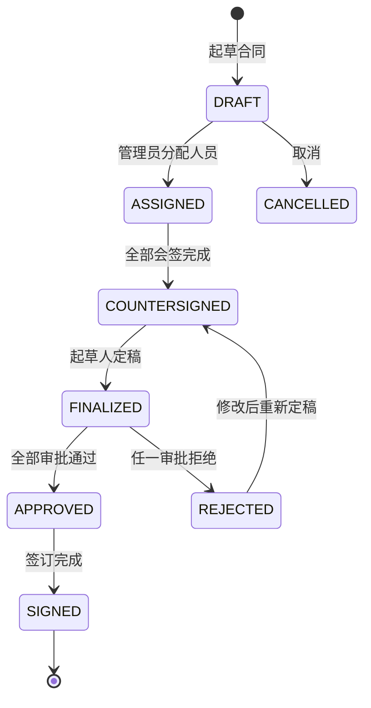

# 合同管理系统架构设计

## 1. 总体架构

一期采用前后端分离的单体分层架构。

## 2. 后端分层

| 层级 | 职责 |
| --- | --- |
| Controller | 接收 HTTP 请求、参数校验、返回统一响应 |
| Application/Service | 编排业务流程、事务控制、权限判断 |
| Domain | 合同状态、流程规则、业务枚举 |
| Repository/Mapper | 数据访问 |
| Infrastructure | 文件存储、日志、JWT、异常处理 |

## 3. 核心领域模型

| 模型 | 说明 |
| --- | --- |
| User | 系统用户，新注册用户默认无权限 |
| Role | 角色，如管理员、合同操作员、新用户 |
| Permission | 功能权限点，如合同起草、合同审批 |
| Customer | 客户基础信息 |
| Contract | 合同基础信息 |
| ContractAttachment | 合同附件 |
| ContractTask | 合同流程任务，即会签、审批、签订的人员任务 |
| ContractStateHistory | 合同状态历史 |
| OperationLog | 操作日志 |

## 4. 合同状态设计

### 4.1 合同状态

| 状态 | 说明 |
| --- | --- |
| DRAFT | 已起草，等待管理员分配 |
| ASSIGNED | 已分配，等待会签 |
| COUNTERSIGNED | 会签完成，等待起草人定稿 |
| FINALIZED | 定稿完成，等待审批 |
| APPROVED | 审批完成且通过，等待签订 |
| REJECTED | 审批拒绝 |
| SIGNED | 签订完成 |
| CANCELLED | 已取消或删除 |

### 4.2 流程任务类型

| 类型 | 说明 |
| --- | --- |
| COUNTERSIGN | 会签任务 |
| APPROVAL | 审批任务 |
| SIGN | 签订任务 |

### 4.3 任务状态

| 状态 | 说明 |
| --- | --- |
| PENDING | 待处理 |
| DONE | 已完成 |
| REJECTED | 已否决 |

## 5. 状态流转

## 6. 权限设计

### 6.1 角色建议

| 角色 | 说明 |
| --- | --- |
| ROLE_ADMIN | 系统管理员，维护用户、角色、权限、日志 |
| ROLE_CONTRACT_ADMIN | 合同管理员，负责合同分配、流程跟踪、日志查询 |
| ROLE_OPERATOR | 合同操作员，起草、会签、定稿、审批、签订 |
| ROLE_NEW_USER | 新用户，注册后默认角色，无业务权限 |

默认角色权限边界：

| 角色 | 默认权限 |
| --- | --- |
| ROLE_ADMIN | 全部权限 |
| ROLE_CONTRACT_ADMIN | `contract:view`、`contract:assign`、`contract:delete`、`log:view` |
| ROLE_OPERATOR | `contract:create`、`contract:update`、`contract:view`、`contract:countersign`、`contract:approve`、`contract:sign`、`customer:manage` |
| ROLE_NEW_USER | 无业务权限 |

### 6.2 权限点建议

| 权限码 | 说明 |
| --- | --- |
| contract:create | 起草合同 |
| contract:update | 修改/定稿合同 |
| contract:delete | 删除合同 |
| contract:view | 查看合同 |
| contract:assign | 分配合同 |
| contract:countersign | 会签合同 |
| contract:approve | 审批合同 |
| contract:sign | 签订合同 |
| customer:manage | 客户管理 |
| user:manage | 用户管理 |
| role:manage | 角色管理 |
| permission:manage | 权限管理 |
| log:view | 日志查询 |

### 6.3 权限执行规则

后端使用 `@RequirePermission` 标注受保护接口。JWT 过滤器会把用户权限点装载为 Spring Security authorities，方法级授权 Advisor 读取 `@RequirePermission` 并在 Controller 方法执行前完成校验。一个接口可以声明多个权限码，用户拥有其中任意一个即可访问。

| 接口范围 | 必需权限 |
| --- | --- |
| `/api/v1/contracts` 查询详情 | `contract:view` |
| 起草合同 | `contract:create` |
| 修改、定稿、附件维护、重新提交 | `contract:update` |
| 删除合同 | `contract:delete` |
| 分配合同 | `contract:assign` |
| 会签合同 | `contract:countersign` |
| 审批合同 | `contract:approve` |
| 签订合同 | `contract:sign` |
| 客户管理 | `customer:manage` |
| 用户管理 | `user:manage` |
| 角色管理 | `role:manage` |
| 权限点列表 | `permission:manage` 或 `role:manage` |
| 日志查询导出 | `log:view` |

新注册用户默认绑定 `ROLE_NEW_USER`，该角色不包含业务权限，只能登录并查看自己的基本信息，等待管理员分配角色。

## 7. 安全策略

1. 密码使用 BCrypt 加密存储。
2. 登录成功返回 JWT，前端通过 `Authorization: Bearer <token>` 调用接口，密钥和过期时间由配置项控制。
3. Spring Security 负责 `/api/v1/**` 认证入口，权限校验收敛到方法级授权，未登录返回 401，无权限返回 403。
4. 合同操作还需做数据权限校验，例如只有被分配的审批人可以审批指定合同。
5. 文件上传限制扩展名、MIME、大小，并使用随机文件名存储。

## 8. 事务边界

| 场景 | 事务内容 |
| --- | --- |
| 起草合同 | 保存合同、附件、初始状态历史 |
| 分配合同 | 保存流程任务、更新合同状态、记录日志 |
| 会签合同 | 更新任务、判断是否全部完成、更新状态 |
| 定稿合同 | 更新合同正文、更新状态、记录状态历史 |
| 审批合同 | 更新审批任务、判断通过/拒绝、更新状态 |
| 签订合同 | 更新签订任务、更新合同签订信息、结束流程 |

## 9. 异常与错误码

| 错误码 | HTTP | 说明 |
| --- | --- | --- |
| 40000 | 400 | 参数错误 |
| 40100 | 401 | 未登录或 Token 无效 |
| 40300 | 403 | 无权限 |
| 40400 | 404 | 资源不存在 |
| 40900 | 409 | 状态冲突，如重复审批 |
| 50000 | 500 | 系统异常 |
