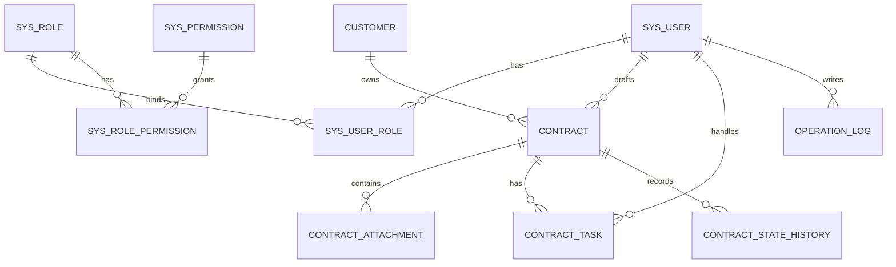

# 合同管理系统数据库设计

## 1. 设计原则

1. 使用 MySQL 8.x，字符集 `utf8mb4`。
2. 主键统一使用 `BIGINT` 自增。
3. 业务编号单独存储，如合同编号、客户编号。
4. 核心表包含 `created_at`、`updated_at`、`deleted` 字段。
5. 合同当前状态存放在 `contract.status`，历史状态存放在 `contract_state_history`。
6. 会签、审批、签订统一抽象为 `contract_task`。

## 2. 表清单

| 表名 | 说明 |
| --- | --- |
| sys_user | 用户 |
| sys_role | 角色 |
| sys_permission | 权限点/功能 |
| sys_user_role | 用户角色关联 |
| sys_role_permission | 角色权限关联 |
| customer | 客户 |
| contract | 合同基础信息 |
| contract_attachment | 合同附件 |
| contract_task | 合同流程任务 |
| contract_state_history | 合同状态历史 |
| operation_log | 操作日志 |

### 2.1 RBAC 权限表关系

系统权限采用 RBAC 模型：

| 表 | 关键字段 | 关系 |
| --- | --- | --- |
| sys_user | username、password_hash、status | 用户基础信息 |
| sys_role | role_code、role_name | 角色定义 |
| sys_permission | permission_code、permission_name、module | 功能权限点 |
| sys_user_role | user_id、role_id | 用户和角色多对多 |
| sys_role_permission | role_id、permission_id | 角色和权限点多对多 |

权限判断链路为：登录用户 -> 用户角色 -> 角色权限点 -> JWT 过滤器装载 authorities -> 接口 `@RequirePermission` 方法级授权。新注册用户默认绑定 `ROLE_NEW_USER`，没有业务权限。

内置角色：

| 角色编码 | 默认权限 |
| --- | --- |
| ROLE_ADMIN | 全部权限 |
| ROLE_CONTRACT_ADMIN | `contract:view`、`contract:assign`、`contract:delete`、`log:view` |
| ROLE_OPERATOR | `contract:create`、`contract:update`、`contract:view`、`contract:countersign`、`contract:approve`、`contract:sign`、`customer:manage` |
| ROLE_NEW_USER | 无业务权限 |

## 3. 枚举定义

### 3.1 用户状态

| 值 | 说明 |
| --- | --- |
| ENABLED | 启用 |
| DISABLED | 禁用 |

### 3.2 合同状态

| 值 | 说明 |
| --- | --- |
| DRAFT | 已起草 |
| ASSIGNED | 已分配 |
| COUNTERSIGNED | 会签完成 |
| FINALIZED | 定稿完成 |
| APPROVED | 审批通过 |
| REJECTED | 审批拒绝 |
| SIGNED | 签订完成 |
| CANCELLED | 已取消 |

### 3.3 合同任务类型与状态

| 字段 | 值 | 说明 |
| --- | --- | --- |
| task_type | COUNTERSIGN | 会签 |
| task_type | APPROVAL | 审批 |
| task_type | SIGN | 签订 |
| task_status | PENDING | 待处理 |
| task_status | DONE | 已完成 |
| task_status | REJECTED | 已否决 |

## 4. 建表 SQL 草案

```sql
CREATE TABLE sys_user (
  id BIGINT PRIMARY KEY AUTO_INCREMENT,
  username VARCHAR(40) NOT NULL UNIQUE,
  password_hash VARCHAR(100) NOT NULL,
  display_name VARCHAR(40),
  phone VARCHAR(20),
  email VARCHAR(100),
  status VARCHAR(20) NOT NULL DEFAULT 'ENABLED',
  created_at DATETIME NOT NULL DEFAULT CURRENT_TIMESTAMP,
  updated_at DATETIME NOT NULL DEFAULT CURRENT_TIMESTAMP ON UPDATE CURRENT_TIMESTAMP,
  deleted TINYINT NOT NULL DEFAULT 0
) ENGINE=InnoDB DEFAULT CHARSET=utf8mb4;

CREATE TABLE sys_role (
  id BIGINT PRIMARY KEY AUTO_INCREMENT,
  role_code VARCHAR(50) NOT NULL UNIQUE,
  role_name VARCHAR(40) NOT NULL,
  description VARCHAR(100),
  created_at DATETIME NOT NULL DEFAULT CURRENT_TIMESTAMP,
  updated_at DATETIME NOT NULL DEFAULT CURRENT_TIMESTAMP ON UPDATE CURRENT_TIMESTAMP,
  deleted TINYINT NOT NULL DEFAULT 0
) ENGINE=InnoDB DEFAULT CHARSET=utf8mb4;

CREATE TABLE sys_permission (
  id BIGINT PRIMARY KEY AUTO_INCREMENT,
  permission_code VARCHAR(80) NOT NULL UNIQUE,
  permission_name VARCHAR(40) NOT NULL,
  module VARCHAR(40) NOT NULL,
  url VARCHAR(200),
  description VARCHAR(100),
  created_at DATETIME NOT NULL DEFAULT CURRENT_TIMESTAMP,
  updated_at DATETIME NOT NULL DEFAULT CURRENT_TIMESTAMP ON UPDATE CURRENT_TIMESTAMP,
  deleted TINYINT NOT NULL DEFAULT 0
) ENGINE=InnoDB DEFAULT CHARSET=utf8mb4;

CREATE TABLE sys_user_role (
  id BIGINT PRIMARY KEY AUTO_INCREMENT,
  user_id BIGINT NOT NULL,
  role_id BIGINT NOT NULL,
  created_at DATETIME NOT NULL DEFAULT CURRENT_TIMESTAMP,
  UNIQUE KEY uk_user_role (user_id, role_id),
  CONSTRAINT fk_user_role_user FOREIGN KEY (user_id) REFERENCES sys_user(id),
  CONSTRAINT fk_user_role_role FOREIGN KEY (role_id) REFERENCES sys_role(id)
) ENGINE=InnoDB DEFAULT CHARSET=utf8mb4;

CREATE TABLE sys_role_permission (
  id BIGINT PRIMARY KEY AUTO_INCREMENT,
  role_id BIGINT NOT NULL,
  permission_id BIGINT NOT NULL,
  created_at DATETIME NOT NULL DEFAULT CURRENT_TIMESTAMP,
  UNIQUE KEY uk_role_permission (role_id, permission_id),
  CONSTRAINT fk_role_permission_role FOREIGN KEY (role_id) REFERENCES sys_role(id),
  CONSTRAINT fk_role_permission_permission FOREIGN KEY (permission_id) REFERENCES sys_permission(id)
) ENGINE=InnoDB DEFAULT CHARSET=utf8mb4;

CREATE TABLE customer (
  id BIGINT PRIMARY KEY AUTO_INCREMENT,
  customer_no VARCHAR(20) NOT NULL UNIQUE,
  name VARCHAR(40) NOT NULL,
  address VARCHAR(100) NOT NULL,
  tel VARCHAR(20) NOT NULL,
  fax VARCHAR(20),
  postal_code VARCHAR(10),
  bank_name VARCHAR(50),
  bank_account VARCHAR(50),
  remark VARCHAR(255),
  created_at DATETIME NOT NULL DEFAULT CURRENT_TIMESTAMP,
  updated_at DATETIME NOT NULL DEFAULT CURRENT_TIMESTAMP ON UPDATE CURRENT_TIMESTAMP,
  deleted TINYINT NOT NULL DEFAULT 0,
  KEY idx_customer_name (name)
) ENGINE=InnoDB DEFAULT CHARSET=utf8mb4;

CREATE TABLE contract (
  id BIGINT PRIMARY KEY AUTO_INCREMENT,
  contract_no VARCHAR(20) NOT NULL UNIQUE,
  name VARCHAR(40) NOT NULL,
  customer_id BIGINT NOT NULL,
  begin_date DATE NOT NULL,
  end_date DATE NOT NULL,
  content TEXT NOT NULL,
  drafter_id BIGINT NOT NULL,
  status VARCHAR(30) NOT NULL DEFAULT 'DRAFT',
  signed_date DATE,
  sign_info TEXT,
  version INT NOT NULL DEFAULT 0,
  created_at DATETIME NOT NULL DEFAULT CURRENT_TIMESTAMP,
  updated_at DATETIME NOT NULL DEFAULT CURRENT_TIMESTAMP ON UPDATE CURRENT_TIMESTAMP,
  deleted TINYINT NOT NULL DEFAULT 0,
  CONSTRAINT fk_contract_customer FOREIGN KEY (customer_id) REFERENCES customer(id),
  CONSTRAINT fk_contract_drafter FOREIGN KEY (drafter_id) REFERENCES sys_user(id),
  KEY idx_contract_name (name),
  KEY idx_contract_status (status),
  KEY idx_contract_customer (customer_id)
) ENGINE=InnoDB DEFAULT CHARSET=utf8mb4;

CREATE TABLE contract_attachment (
  id BIGINT PRIMARY KEY AUTO_INCREMENT,
  contract_id BIGINT NOT NULL,
  original_name VARCHAR(100) NOT NULL,
  storage_path VARCHAR(255) NOT NULL,
  file_type VARCHAR(20) NOT NULL,
  file_size BIGINT NOT NULL DEFAULT 0,
  uploaded_by BIGINT NOT NULL,
  uploaded_at DATETIME NOT NULL DEFAULT CURRENT_TIMESTAMP,
  deleted TINYINT NOT NULL DEFAULT 0,
  CONSTRAINT fk_attachment_contract FOREIGN KEY (contract_id) REFERENCES contract(id),
  CONSTRAINT fk_attachment_user FOREIGN KEY (uploaded_by) REFERENCES sys_user(id),
  KEY idx_attachment_contract (contract_id)
) ENGINE=InnoDB DEFAULT CHARSET=utf8mb4;

CREATE TABLE contract_task (
  id BIGINT PRIMARY KEY AUTO_INCREMENT,
  contract_id BIGINT NOT NULL,
  task_type VARCHAR(30) NOT NULL,
  task_status VARCHAR(30) NOT NULL DEFAULT 'PENDING',
  assignee_id BIGINT NOT NULL,
  opinion TEXT,
  operated_at DATETIME,
  created_at DATETIME NOT NULL DEFAULT CURRENT_TIMESTAMP,
  updated_at DATETIME NOT NULL DEFAULT CURRENT_TIMESTAMP ON UPDATE CURRENT_TIMESTAMP,
  CONSTRAINT fk_task_contract FOREIGN KEY (contract_id) REFERENCES contract(id),
  CONSTRAINT fk_task_assignee FOREIGN KEY (assignee_id) REFERENCES sys_user(id),
  UNIQUE KEY uk_contract_task_user (contract_id, task_type, assignee_id),
  KEY idx_task_assignee_status (assignee_id, task_status),
  KEY idx_task_contract_type (contract_id, task_type)
) ENGINE=InnoDB DEFAULT CHARSET=utf8mb4;

CREATE TABLE contract_state_history (
  id BIGINT PRIMARY KEY AUTO_INCREMENT,
  contract_id BIGINT NOT NULL,
  from_status VARCHAR(30),
  to_status VARCHAR(30) NOT NULL,
  operator_id BIGINT NOT NULL,
  remark VARCHAR(255),
  created_at DATETIME NOT NULL DEFAULT CURRENT_TIMESTAMP,
  CONSTRAINT fk_state_contract FOREIGN KEY (contract_id) REFERENCES contract(id),
  CONSTRAINT fk_state_operator FOREIGN KEY (operator_id) REFERENCES sys_user(id),
  KEY idx_state_contract (contract_id)
) ENGINE=InnoDB DEFAULT CHARSET=utf8mb4;

CREATE TABLE operation_log (
  id BIGINT PRIMARY KEY AUTO_INCREMENT,
  operator_id BIGINT,
  operator_name VARCHAR(40),
  module VARCHAR(40) NOT NULL,
  action VARCHAR(40) NOT NULL,
  target_type VARCHAR(40),
  target_id BIGINT,
  content TEXT NOT NULL,
  ip VARCHAR(64),
  created_at DATETIME NOT NULL DEFAULT CURRENT_TIMESTAMP,
  KEY idx_log_operator (operator_id),
  KEY idx_log_module (module),
  KEY idx_log_created_at (created_at)
) ENGINE=InnoDB DEFAULT CHARSET=utf8mb4;
```

## 5. 初始化数据建议

```sql
INSERT INTO sys_role (role_code, role_name, description) VALUES
('ROLE_ADMIN', '系统管理员', '维护用户、角色、权限和日志'),
('ROLE_CONTRACT_ADMIN', '合同管理员', '负责合同分配和流程跟踪'),
('ROLE_OPERATOR', '合同操作员', '负责合同业务操作'),
('ROLE_NEW_USER', '新用户', '注册后的默认角色');
```

权限点可按接口粒度或菜单粒度初始化，建议先按功能粒度初始化，后续再细化。

## 6. 关系说明


