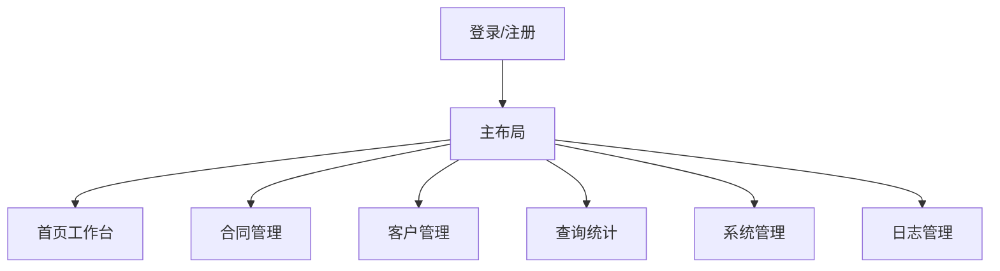

# 合同管理系统前端设计

## 1. 前端目标

构建一个面向合同管理员和合同操作员的后台管理系统，重点支持高效处理待办、清晰查看合同状态、稳定完成起草到签订的全流程。

## 2. 页面结构



## 3. 路由规划

| 路由 | 页面 | 权限 |
| --- | --- | --- |
| `/login` | 登录 | 公开 |
| `/register` | 注册 | 公开 |
| `/dashboard` | 工作台 | 登录用户 |
| `/contracts` | 合同列表 | `contract:view` |
| `/contracts/create` | 起草合同 | `contract:create` |
| `/contracts/:id` | 合同详情 | `contract:view` |
| `/contracts/:id/assign` | 分配合同 | `contract:assign` |
| `/tasks/countersign` | 待会签 | `contract:countersign` |
| `/tasks/finalize` | 待定稿 | `contract:update` |
| `/tasks/approval` | 待审批 | `contract:approve` |
| `/tasks/sign` | 待签订 | `contract:sign` |
| `/customers` | 客户管理 | `customer:manage` |
| `/statistics/contracts` | 合同统计 | `contract:view` |
| `/system/users` | 用户管理 | `user:manage` |
| `/system/roles` | 角色管理 | `role:manage` |
| `/system/permissions` | 权限管理 | `permission:manage` |
| `/logs` | 日志管理 | `log:view` |

## 4. 主布局

### 4.1 布局区域

| 区域 | 内容 |
| --- | --- |
| 顶栏 | 系统名称、当前用户、登出 |
| 侧边栏 | 按权限动态渲染菜单 |
| 内容区 | 列表、表单、详情、流程操作 |
| 面包屑 | 显示当前模块路径 |

### 4.2 菜单分组

| 分组 | 菜单 |
| --- | --- |
| 工作台 | 首页、我的待办 |
| 合同管理 | 合同列表、起草合同、待会签、待定稿、待审批、待签订 |
| 基础数据 | 客户管理 |
| 查询统计 | 合同查询、流程查询 |
| 系统管理 | 用户管理、角色管理、权限管理、日志管理 |

## 5. 核心页面设计

### 5.1 登录页

字段：

| 字段 | 校验 |
| --- | --- |
| 用户名 | 必填 |
| 密码 | 必填 |

交互：

1. 登录成功保存 Token。
2. 请求 `/auth/me` 获取用户信息、权限、菜单。
3. 根据角色跳转工作台。

### 5.2 工作台

展示：

| 模块 | 内容 |
| --- | --- |
| 待办卡片 | 待会签、待审批、待签订数量 |
| 合同状态 | DRAFT、ASSIGNED、SIGNED 等数量 |
| 最近合同 | 最近创建或最近操作合同 |
| 快捷入口 | 起草合同、客户管理、合同查询 |

### 5.3 合同列表页

查询条件：

| 字段 | 类型 |
| --- | --- |
| 合同编号 | 输入框 |
| 合同名称 | 输入框 |
| 客户 | 远程搜索选择 |
| 状态 | 下拉选择 |
| 起止日期 | 日期范围 |

表格列：

| 列 | 说明 |
| --- | --- |
| 合同编号 | 可点击进入详情 |
| 合同名称 | 文本 |
| 客户 | 客户名称 |
| 起草人 | 用户名称 |
| 起止日期 | 日期 |
| 状态 | 状态标签 |
| 更新时间 | 时间 |
| 操作 | 查看、编辑、分配、删除 |

### 5.4 起草合同页

表单字段：

| 字段 | 控件 | 校验 |
| --- | --- | --- |
| 合同名称 | 输入框 | 必填，最长 40 |
| 客户 | 选择器 | 必填 |
| 开始日期 | 日期选择 | 必填 |
| 结束日期 | 日期选择 | 必填，大于等于开始日期 |
| 合同内容 | 富文本或文本域 | 必填 |
| 附件 | 上传组件 | doc、jpg、jpeg、png、bmp、gif |

### 5.5 合同详情页

标签页：

| 标签 | 内容 |
| --- | --- |
| 基础信息 | 合同字段、客户、起草人、状态 |
| 合同正文 | 合同内容 |
| 附件 | 附件列表、下载 |
| 流程记录 | 会签、审批、签订任务 |
| 状态历史 | 状态变更时间线 |

### 5.6 分配合同页

展示合同基础信息，并选择：

| 人员类型 | 控件 |
| --- | --- |
| 会签人员 | 多选用户 |
| 审批人员 | 多选用户 |
| 签订人员 | 多选用户 |

提交前校验三类人员均不能为空。

### 5.7 会签/审批/签订页

统一采用“任务列表 + 操作弹窗/页面”。

| 任务 | 操作字段 |
| --- | --- |
| 会签 | 会签意见 |
| 审批 | 审批结果、审批意见 |
| 签订 | 签订日期、签订信息 |

## 6. 前端状态管理

| Store | 内容 |
| --- | --- |
| authStore | Token、用户信息、角色、权限 |
| appStore | 菜单、主题、侧边栏状态 |
| dictionaryStore | 合同状态、任务类型等字典 |

## 7. 权限控制

1. 路由进入前检查是否登录。
2. 页面菜单按用户权限动态渲染。
3. 按钮级权限通过指令或组件判断。
4. 后端仍必须做最终权限校验。

按钮权限示例：

| 按钮 | 权限 |
| --- | --- |
| 起草合同 | `contract:create` |
| 分配合同 | `contract:assign` |
| 会签 | `contract:countersign` |
| 审批 | `contract:approve` |
| 用户新增 | `user:manage` |

## 8. API 封装建议

```text
src/api
  auth.ts
  users.ts
  roles.ts
  permissions.ts
  customers.ts
  contracts.ts
  tasks.ts
  logs.ts
  statistics.ts
```

Axios 拦截器：

1. 请求时自动附加 Token。
2. 401 自动跳转登录。
3. 403 显示无权限提示。
4. 统一处理错误消息。

## 9. 表单与体验要求

1. 必填字段即时校验。
2. 保存、提交、审批等操作显示确认弹窗。
3. 流程类操作提交后刷新待办和合同详情。
4. 上传附件显示进度、大小、失败原因。
5. 合同状态用颜色标签区分，但不能只依赖颜色表达含义。

