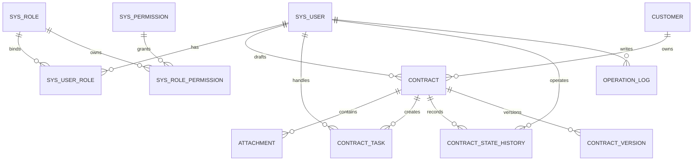

# 合同管理系统 5 分钟答辩稿与数据库设计

## 1. PPT 答辩稿

### 第 1 页：项目背景与目标（约 35 秒）

各位老师好，我们小组完成的是一个合同管理系统。项目面向企业内部合同流转场景，解决传统合同管理中信息分散、流程状态不透明、权限边界不清晰、历史记录难追踪的问题。

系统的目标不是只做一个合同列表，而是覆盖从客户维护、合同起草、附件上传、流程分配、会签、定稿、审批、签订，到日志审计和统计导出的完整闭环。最终实现前后端分离、角色权限控制、流程状态机、数据库持久化和自动化测试验证。

### 第 2 页：系统功能模块（约 45 秒）

系统主要分为六个模块。

第一是认证和权限模块，用户登录后通过 JWT 访问接口，后端根据角色和权限点控制菜单和接口访问。

第二是客户管理模块，用于维护合同关联的客户主数据，包括名称、电话、地址、银行信息等。

第三是合同管理模块，支持合同起草、修改、查询、详情查看、附件上传下载、模板起草和版本记录。

第四是合同流程模块，围绕合同状态完成分配、会签、定稿、审批、签订等动作。

第五是统计与导出模块，可以查看合同状态分布、月度统计，并导出 CSV。

第六是操作日志模块，记录关键业务动作，便于后续审计和问题追踪。

### 第 3 页：技术架构（约 45 秒）

系统采用前后端分离架构。前端使用 Vue 3、Vite、Pinia 和 Vue Router，负责页面展示、路由权限和表单交互。后端使用 Spring Boot 3，按 Controller、Service、Repository 分层组织业务。

后端安全部分使用 Spring Security 和 JWT。用户登录后，系统把用户角色和权限点装载到认证上下文，接口通过 `@RequirePermission` 做方法级权限校验。

数据库层使用 JPA 和 Flyway。Flyway 负责建表迁移，JPA 负责实体映射和查询。项目支持 H2 本地演示，也保留 MySQL、PostgreSQL profile，便于不同环境部署。

文件附件采用本地文件存储，数据库只保存附件元数据和存储文件名。这样可以避免大文件直接进入数据库，同时方便下载和权限校验。

### 第 4 页：核心合同流程（约 60 秒）

合同流程是系统最核心的部分。合同创建后初始状态为 `DRAFT`，也就是已起草，等待管理员分配流程人员。

管理员分配会签人、审批人和签订人后，合同进入 `ASSIGNED` 状态。系统同时生成 `contract_task` 任务记录。

会签阶段要求所有会签人都提交意见，全部完成后合同变为 `COUNTERSIGNED`。然后由起草人定稿，定稿后进入 `FINALIZED`。

审批阶段支持多人审批。如果任意审批人拒绝，合同进入 `REJECTED`；如果所有审批人通过，合同进入 `APPROVED`。

最后签订人录入签订信息和签订日期，合同状态变为 `SIGNED`，流程结束。

这个设计的关键点是：合同当前状态放在 `contract.status`，历史状态写入 `contract_state_history`，每个处理人的待办任务放在 `contract_task`。这样既能快速查询当前状态，也能追踪完整历史。

### 第 5 页：数据库设计（约 65 秒）

数据库围绕三条主线设计。

第一条是权限主线，包括 `sys_user`、`sys_role`、`sys_permission`、`sys_user_role`、`sys_role_permission`。这是标准 RBAC 模型，一个用户可以绑定角色，一个角色可以拥有多个权限点，接口根据权限点判断能否访问。

第二条是合同业务主线，包括 `customer`、`contract`、`attachment`、`contract_task`、`contract_state_history`。客户和合同是一对多关系；合同和附件、任务、状态历史都是一对多关系。

第三条是扩展和审计主线，包括 `operation_log`、`contract_template`、`contract_version`。操作日志记录谁在什么时候做了什么；合同模板支持快速起草；合同版本记录正文变更，便于回溯。

表设计上，主键统一使用 `BIGINT` 自增，业务编号如合同编号、客户编号单独唯一约束。核心查询字段建立索引，例如合同状态、客户名称、待办处理人和日志时间，保证常用查询效率。

### 第 6 页：安全与稳定性设计（约 45 秒）

安全方面，密码使用 BCrypt 加密保存，前后端通过 JWT 鉴权，未登录返回 401，无权限返回 403。新注册用户默认绑定 `ROLE_NEW_USER`，没有业务权限，需要管理员分配角色后才能使用业务功能。

流程安全方面，不只是看权限点，还会做数据权限判断。例如只有被分配的会签人才能会签指定合同，只有审批任务的处理人才能审批，只有起草人可以定稿。

稳定性方面，系统对日期参数、JSON 格式、缺失参数和文件大小都有明确异常处理。文件上传限制大小、扩展名和内容类型。统计缓存通过合同变更事件失效，避免创建、删除后统计数据脏读。

### 第 7 页：测试与演示验证（约 45 秒）

测试分为后端自动化测试、前端构建验证和端到端流程验证。

后端测试覆盖权限矩阵、注册登录边界、客户和合同校验、流程状态机、附件上传、CSV 导出和异常处理。前端执行 Vite build，保证页面构建通过。

端到端测试使用 Playwright 模拟真实用户输入，覆盖登录、客户新增、带附件起草合同、流程分配、会签、定稿、审批、签订、查询、导出和日志查看。

演示时可以通过 `scripts/start-demo.ps1` 一键启动后端和前端，使用演示数据直接展示完整流程。

### 第 8 页：总结（约 20 秒）

总体来说，本系统完成了合同管理从数据维护到流程闭环的主要功能，并通过 RBAC 权限、状态机、操作日志、版本记录和自动化测试保证系统可用、可控、可追踪。

后续如果继续完善，可以接入对象存储、消息通知、电子签章和更细粒度的数据权限，使系统更接近真实企业级合同管理平台。谢谢各位老师。

## 2. PPT 可放的数据库总览表

| 分类 | 表名 | 作用 |
| --- | --- | --- |
| 权限 | `sys_user` | 用户账号、密码、状态和基础信息 |
| 权限 | `sys_role` | 角色定义，如管理员、合同管理员、操作员、新用户 |
| 权限 | `sys_permission` | 权限点定义，如合同起草、审批、用户管理 |
| 权限 | `sys_user_role` | 用户与角色多对多关系 |
| 权限 | `sys_role_permission` | 角色与权限点多对多关系 |
| 客户 | `customer` | 客户主数据 |
| 合同 | `contract` | 合同基础信息和当前状态 |
| 合同 | `attachment` | 合同附件元数据 |
| 流程 | `contract_task` | 会签、审批、签订待办任务 |
| 流程 | `contract_state_history` | 合同状态变更历史 |
| 审计 | `operation_log` | 业务操作日志 |
| 扩展 | `contract_template` | 合同模板 |
| 扩展 | `contract_version` | 合同正文版本记录 |

## 3. 核心表字段设计

### 3.1 `sys_user` 用户表

| 字段 | 类型 | 约束 | 说明 |
| --- | --- | --- | --- |
| `id` | BIGINT | PK，自增 | 用户 ID |
| `username` | VARCHAR(40) | UNIQUE，NOT NULL | 登录名 |
| `password_hash` | VARCHAR(100) | NOT NULL | BCrypt 密码摘要 |
| `display_name` | VARCHAR(40) |  | 显示名称 |
| `phone` | VARCHAR(20) |  | 手机号 |
| `email` | VARCHAR(100) |  | 邮箱 |
| `status` | VARCHAR(20) | NOT NULL | `ENABLED` / `DISABLED` |
| `created_at` | DATETIME(6) | NOT NULL | 创建时间 |
| `updated_at` | DATETIME(6) | NOT NULL | 更新时间 |
| `deleted` | BOOLEAN | NOT NULL | 逻辑删除标记 |

### 3.2 `sys_role` 角色表

| 字段 | 类型 | 约束 | 说明 |
| --- | --- | --- | --- |
| `id` | BIGINT | PK，自增 | 角色 ID |
| `role_code` | VARCHAR(50) | UNIQUE，NOT NULL | 角色编码 |
| `role_name` | VARCHAR(40) | NOT NULL | 角色名称 |
| `description` | VARCHAR(100) |  | 角色说明 |

### 3.3 `sys_permission` 权限表

| 字段 | 类型 | 约束 | 说明 |
| --- | --- | --- | --- |
| `id` | BIGINT | PK，自增 | 权限 ID |
| `permission_code` | VARCHAR(80) | UNIQUE，NOT NULL | 权限码 |
| `permission_name` | VARCHAR(40) | NOT NULL | 权限名称 |
| `module` | VARCHAR(40) | NOT NULL | 所属模块 |
| `url` | VARCHAR(200) |  | 对应接口或菜单 |
| `description` | VARCHAR(100) |  | 权限说明 |

### 3.4 `customer` 客户表

| 字段 | 类型 | 约束 | 说明 |
| --- | --- | --- | --- |
| `id` | BIGINT | PK，自增 | 客户 ID |
| `customer_no` | VARCHAR(20) | UNIQUE，NOT NULL | 客户编号 |
| `name` | VARCHAR(40) | NOT NULL | 客户名称 |
| `address` | VARCHAR(100) | NOT NULL | 地址 |
| `tel` | VARCHAR(20) | NOT NULL | 电话 |
| `fax` | VARCHAR(255) |  | 传真 |
| `postal_code` | VARCHAR(255) |  | 邮编 |
| `bank_name` | VARCHAR(255) |  | 开户行 |
| `bank_account` | VARCHAR(255) |  | 银行账号 |
| `remark` | VARCHAR(255) |  | 备注 |
| `created_at` | DATETIME(6) | NOT NULL | 创建时间 |
| `updated_at` | DATETIME(6) | NOT NULL | 更新时间 |
| `deleted` | BOOLEAN | NOT NULL | 逻辑删除标记 |

### 3.5 `contract` 合同表

| 字段 | 类型 | 约束 | 说明 |
| --- | --- | --- | --- |
| `id` | BIGINT | PK，自增 | 合同 ID |
| `contract_no` | VARCHAR(20) | UNIQUE，NOT NULL | 合同编号 |
| `name` | VARCHAR(40) | NOT NULL | 合同名称 |
| `customer_id` | BIGINT | FK，NOT NULL | 关联客户 |
| `begin_date` | DATE | NOT NULL | 合同开始日期 |
| `end_date` | DATE | NOT NULL | 合同结束日期 |
| `content` | LONGTEXT | NOT NULL | 合同正文 |
| `drafter_id` | BIGINT | FK，NOT NULL | 起草人 |
| `status` | VARCHAR(30) | NOT NULL | 当前状态 |
| `signed_date` | DATE |  | 签订日期 |
| `sign_info` | LONGTEXT |  | 签订信息 |
| `version` | INT | NOT NULL | 乐观锁版本 |
| `created_at` | DATETIME(6) | NOT NULL | 创建时间 |
| `updated_at` | DATETIME(6) | NOT NULL | 更新时间 |
| `deleted` | BOOLEAN | NOT NULL | 逻辑删除标记 |

### 3.6 `contract_task` 流程任务表

| 字段 | 类型 | 约束 | 说明 |
| --- | --- | --- | --- |
| `id` | BIGINT | PK，自增 | 任务 ID |
| `contract_id` | BIGINT | FK，NOT NULL | 合同 ID |
| `task_type` | VARCHAR(30) | NOT NULL | `COUNTERSIGN` / `APPROVAL` / `SIGN` |
| `task_status` | VARCHAR(30) | NOT NULL | `PENDING` / `DONE` / `REJECTED` |
| `assignee_id` | BIGINT | FK，NOT NULL | 处理人 |
| `opinion` | LONGTEXT |  | 处理意见 |
| `operated_at` | DATETIME(6) |  | 处理时间 |
| `created_at` | DATETIME(6) | NOT NULL | 创建时间 |

### 3.7 `contract_state_history` 状态历史表

| 字段 | 类型 | 约束 | 说明 |
| --- | --- | --- | --- |
| `id` | BIGINT | PK，自增 | 历史 ID |
| `contract_id` | BIGINT | FK，NOT NULL | 合同 ID |
| `from_status` | VARCHAR(255) |  | 原状态 |
| `to_status` | VARCHAR(255) | NOT NULL | 新状态 |
| `operator_id` | BIGINT | FK，NOT NULL | 操作人 |
| `remark` | VARCHAR(255) |  | 状态变更说明 |
| `created_at` | DATETIME(6) | NOT NULL | 发生时间 |

### 3.8 `attachment` 附件表

| 字段 | 类型 | 约束 | 说明 |
| --- | --- | --- | --- |
| `id` | BIGINT | PK，自增 | 附件 ID |
| `contract_id` | BIGINT | FK，NOT NULL | 所属合同 |
| `original_name` | VARCHAR(255) | NOT NULL | 原文件名 |
| `stored_name` | VARCHAR(255) | NOT NULL | 存储文件名 |
| `content_type` | VARCHAR(255) | NOT NULL | MIME 类型 |
| `file_size` | BIGINT | NOT NULL | 文件大小 |
| `uploader_id` | BIGINT | FK，NOT NULL | 上传人 |
| `uploaded_at` | DATETIME(6) | NOT NULL | 上传时间 |

### 3.9 `operation_log` 操作日志表

| 字段 | 类型 | 约束 | 说明 |
| --- | --- | --- | --- |
| `id` | BIGINT | PK，自增 | 日志 ID |
| `operator_id` | BIGINT | FK，可空 | 操作人 ID |
| `operator_name` | VARCHAR(40) |  | 操作人名称 |
| `module` | VARCHAR(40) | NOT NULL | 模块 |
| `action` | VARCHAR(40) | NOT NULL | 动作 |
| `target_type` | VARCHAR(40) |  | 操作对象类型 |
| `target_id` | BIGINT |  | 操作对象 ID |
| `content` | LONGTEXT | NOT NULL | 日志内容 |
| `ip` | VARCHAR(64) |  | IP 地址 |
| `created_at` | DATETIME(6) | NOT NULL | 操作时间 |

### 3.10 扩展表

| 表名 | 关键字段 | 说明 |
| --- | --- | --- |
| `contract_template` | `name`、`description`、`content`、`enabled` | 合同模板，支持采购合同、服务合同等快速起草 |
| `contract_version` | `contract_id`、`version_no`、`content`、`operator_id` | 合同版本历史，`contract_id + version_no` 唯一 |

## 4. 主要关系与索引设计

### 4.1 表关系

### 4.2 索引

| 索引 | 字段 | 目的 |
| --- | --- | --- |
| `uk_sys_user_username` | `sys_user.username` | 保证用户名唯一，登录快速定位用户 |
| `uk_sys_role_code` | `sys_role.role_code` | 保证角色编码唯一 |
| `uk_sys_permission_code` | `sys_permission.permission_code` | 保证权限码唯一 |
| `uk_customer_no` | `customer.customer_no` | 保证客户编号唯一 |
| `uk_contract_no` | `contract.contract_no` | 保证合同编号唯一 |
| `idx_customer_name_deleted` | `customer(name, deleted)` | 客户名称模糊查询和逻辑删除过滤 |
| `idx_contract_status_deleted` | `contract(status, deleted)` | 合同状态筛选和统计 |
| `idx_contract_task_assignee_status` | `contract_task(assignee_id, task_status)` | 我的待办列表 |
| `idx_contract_history_created_at` | `contract_state_history(created_at)` | 流程时间线排序 |
| `idx_operation_log_created_at` | `operation_log(created_at)` | 日志按时间查询 |
| `idx_operation_log_module` | `operation_log(module)` | 按模块筛选日志 |

## 5. 可能的答辩问题与应对

### Q1：为什么要设计 `contract_task`，不直接在合同表里存会签人、审批人？

答：因为会签、审批、签订都是“人员任务”，并且可能多人参与。如果直接放在合同表，会出现字段不固定、扩展困难的问题。抽象成 `contract_task` 后，可以统一记录任务类型、处理人、任务状态、意见和处理时间。这样“我的待办”和流程追踪也更容易实现。

### Q2：为什么合同当前状态和历史状态要分两张表？

答：`contract.status` 用于快速查询当前状态，例如列表筛选和统计；`contract_state_history` 用于保存完整流转轨迹。两者职责不同，一个面向当前业务查询，一个面向审计和回溯。

### Q3：系统如何保证只有指定审批人才能审批？

答：首先接口需要用户拥有 `contract:approve` 权限。其次业务层还会查询 `contract_task`，确认当前用户是否是该合同的待审批处理人，并且任务状态是 `PENDING`。只有同时满足权限和数据归属，才能审批。

### Q4：为什么新注册用户默认没有业务权限？

答：这是最小权限原则。新用户注册后只绑定 `ROLE_NEW_USER`，不能直接访问合同、客户、用户管理等业务功能，必须由管理员分配角色。这样可以避免注册账号越权操作。

### Q5：附件为什么不直接存数据库？

答：附件文件可能比较大，直接存数据库会增加数据库体积和备份压力。系统采用文件系统保存实体文件，数据库保存原文件名、存储名、大小、类型、上传人和合同 ID。这样既能做权限控制，也便于下载和管理。

### Q6：如果两个用户同时操作同一份合同怎么办？

答：合同实体包含 `version` 字段，作为乐观锁版本。流程写操作由后端事务控制，同时在状态变更前校验当前状态，避免重复审批、重复签订或跨状态操作。

### Q7：为什么要用 RBAC，而不是每个用户直接配置权限？

答：RBAC 更适合企业系统。用户通过角色获得权限，管理员只需要维护角色权限和用户角色关系。相比直接给用户分权限，RBAC 更容易复用，也方便统一调整岗位权限。

### Q8：操作日志和状态历史有什么区别？

答：状态历史只记录合同状态变化，例如 `DRAFT` 到 `ASSIGNED`。操作日志记录更广，包括客户新增、用户启停、角色权限修改、附件上传删除、合同导出等。一个面向合同流程，一个面向系统审计。

### Q9：为什么要做 CSV 公式注入防护？

答：CSV 被 Excel 打开时，如果单元格以 `=`、`+`、`-`、`@` 开头，可能被当作公式执行。系统导出时会对这些字段加前缀并统一转义，避免导出文件造成安全风险。

### Q10：系统如何处理日期参数和文件上传异常？

答：日期统一按 ISO 格式 `yyyy-MM-dd` 解析。后端对日期格式错误、JSON 解析错误、缺少 multipart 参数、上传文件超限等异常做专门处理，返回明确的 400 或 413，而不是笼统的 500。

### Q11：为什么使用 Flyway？

答：Flyway 可以把数据库结构变更脚本版本化，保证开发、测试、演示环境的表结构一致。系统启动时会自动执行迁移脚本，减少手工建表出错。

### Q12：项目目前还有哪些可改进点？

答：可以从四个方向继续增强：第一，文件存储接入对象存储；第二，流程通知接入邮件或站内消息；第三，签订环节接入电子签章；第四，数据权限按部门、组织架构继续细化。

## 6. 演示时可强调的亮点

| 亮点 | 说明 |
| --- | --- |
| 流程闭环 | 起草、分配、会签、定稿、审批、签订完整贯通 |
| 权限边界 | RBAC 权限点 + 数据归属双重校验 |
| 可追踪 | 状态历史、任务记录、操作日志、合同版本 |
| 稳定性 | 日期、附件、状态机、导出和缓存都有边界处理 |
| 可演示 | 一键脚本启动演示环境，Playwright 已验证真实输入流程 |

## 7. 建议 PPT 页面结构

| 页码 | 标题 | 建议内容 |
| --- | --- | --- |
| 1 | 项目背景 | 痛点、目标、系统定位 |
| 2 | 功能模块 | 认证权限、客户、合同、流程、统计、日志 |
| 3 | 技术架构 | Vue + Spring Boot + JPA/Flyway + JWT |
| 4 | 合同流程 | 状态流转图 |
| 5 | 数据库设计 | 表分类、核心 ER 图 |
| 6 | 安全与稳定性 | RBAC、数据权限、异常处理、附件安全 |
| 7 | 测试与演示 | 后端测试、构建验证、Playwright 流程 |
| 8 | 总结展望 | 已完成能力、后续改进 |
